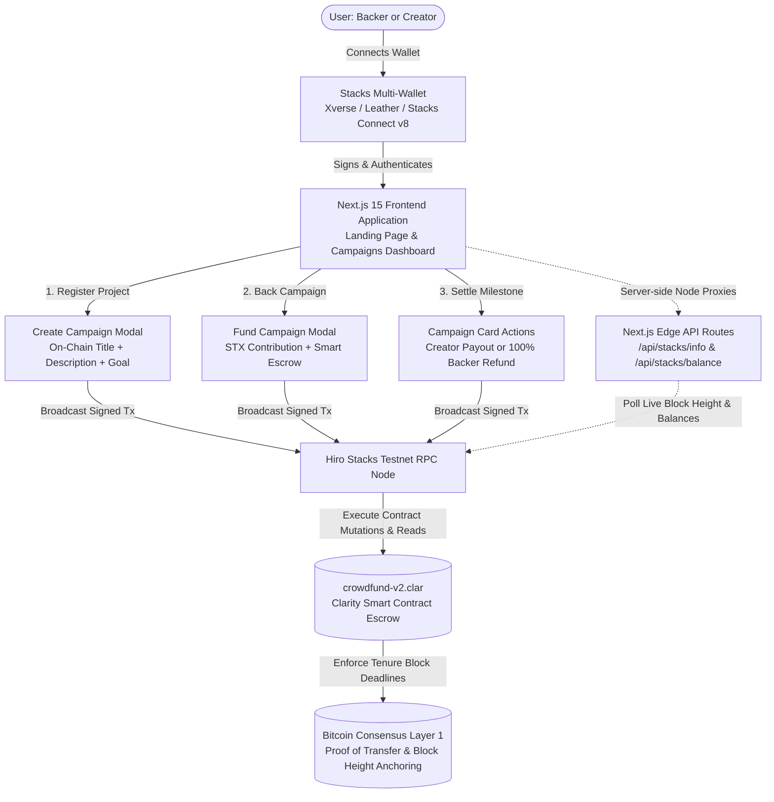

#  StacksRaise

> **Decentralized block-height crowdfunding secured by Bitcoin on Stacks.**

[](https://explorer.hiro.so/txid/0xf175d11ad806e4a51474667a274f2151af9cab792cbbd7b9ceeaaca8051a3d27?chain=testnet)
[](https://docs.stacks.co/clarity)
[](https://nextjs.org/)
[](https://scaffoldstacks.mintlify.app/)
[](LICENSE)

---

## 📋 Table of Contents

- [Overview](#-overview)
- [Live Testnet Deployment](#-live-testnet-deployment)
- [System Architecture](#-system-architecture)
- [On-Chain Project Registration (Zero LocalStorage)](#-on-chain-project-registration-zero-localstorage)
- [Project Directory Structure](#-project-directory-structure)
- [Smart Contract Specification](#-smart-contract-specification)
- [Frontend Experience & Lifecycle States](#-frontend-experience--lifecycle-states)
- [Developer Quickstart](#-developer-quickstart)
- [Test & Verification Results](#-test--verification-results)
- [License](#-license)

---

## 🌟 Overview

**StacksRaise** is a trustless, decentralized crowdfunding protocol built on the Stacks blockchain and anchored to Bitcoin consensus.

Traditional crowdfunding platforms suffer from opaque escrow custody, third-party payment freezes, high processing fees, and arbitrarily extended campaign deadlines. StacksRaise eliminates counterparty risk by encoding campaign logic into immutable Clarity smart contracts where:
1. **Deadlines are governed strictly by Bitcoin tenure block heights** (Clarity `block-height`).
2. **Funds are locked in non-custodial smart contract escrow vaults**.
3. **Guaranteed 1-Click Refunds**: If a campaign falls short of its goal when the deadline arrives, contributors can immediately claim 100% of their STX back directly on-chain.
4. **100% On-Chain Project Registration**: Campaign titles and missions are stored directly in Clarity contract maps—**no browser local storage or centralized database**.
5. **Zero Mock Data**: All feed cards, balance metrics, and live block trackers read directly from Stacks Testnet nodes and smart contracts.

---

## 🔗 Live Testnet Deployment

The active, feature-complete contract (`crowdfund-v2`) is deployed and fully verified on Stacks Testnet:

| Parameter | Active Contract (v2) | Initial Milestone (v1) |
| :--- | :--- | :--- |
| **Contract Name** | `crowdfund-v2` | `crowdfund` |
| **Contract Address** | `ST3E6N4PVNF8H0BJVQQR5A6KA9HMD9DDV5SW988C9.crowdfund-v2` | `ST3E6N4PVNF8H0BJVQQR5A6KA9HMD9DDV5SW988C9.crowdfund` |
| **Deployment Tx** | [`0xf175d11ad806e4a51474667a274f2151af9cab792cbbd7b9ceeaaca8051a3d27`](https://explorer.hiro.so/txid/0xf175d11ad806e4a51474667a274f2151af9cab792cbbd7b9ceeaaca8051a3d27?chain=testnet) | [`0xac80ca32ec05d71f7ff1a95dcbf122763a61f744dbbeba26cbe4f3273e297fc7`](https://explorer.hiro.so/txid/0xac80ca32ec05d71f7ff1a95dcbf122763a61f744dbbeba26cbe4f3273e297fc7?chain=testnet) |
| **Status** | **SUCCESS (Confirmed On-Chain)** | Confirmed On-Chain |
| **Key Capability** | On-chain project metadata (`title`, `description`) | Core block escrow |
| **Hiro Explorer** | [View Active Contract on Hiro Explorer ↗](https://explorer.hiro.so/txid/0xf175d11ad806e4a51474667a274f2151af9cab792cbbd7b9ceeaaca8051a3d27?chain=testnet) | [View Milestone v1 ↗](https://explorer.hiro.so/txid/0xac80ca32ec05d71f7ff1a95dcbf122763a61f744dbbeba26cbe4f3273e297fc7?chain=testnet) |

---

## 🏗 System Architecture



### Architecture Highlights:
- **Clarity Smart Contract**: Epoch 2.5 compatible, enforces mathematical pre-conditions (`asserts!`), micro-STX precision, and zero-custody escrow.
- **Scaffold Stacks TypeScript SDK**: Auto-generated type-safe bindings (`frontend/src/generated/`) map Clarity functions directly to React hooks.
- **Server-Side API Proxies (`/api/stacks/*`)**: Route requests server-side through Next.js to bypass client adblockers (Brave Shields, uBlock) and browser CORS restrictions.
- **Jotai State Store**: Manages reactive wallet connection, balance fetching, and tenure chain tip updates.
- **Framer Motion Micro-Interactions**: Smooth view transitions, responsive spring modals, and animated progress bars.

---

## 🛡 On-Chain Project Registration

When a creator creates a crowdfunding campaign:
- **Project Title / Name** (`string-ascii 64`): Stored directly in the `Campaigns` Clarity data map.
- **Project Mission & Description** (`string-utf8 256`): Stored immutably on-chain so every contributor can read the project's exact purpose, roadmap, and delivery promise.
- **Validation**: Enforced at the consensus layer with `ERR_EMPTY_TITLE (u108)` and `ERR_EMPTY_DESCRIPTION (u109)`.

---

## 📁 Project Directory Structure

```text
stacks-raise/
├── contracts/                            # Smart Contract Layer
│   ├── Clarinet.toml                     # Clarinet project configuration
│   ├── contracts/
│   │   ├── crowdfund-v2.clar             # Active Clarity contract with on-chain project metadata
│   │   └── crowdfund.clar                # Historical v1 deployment contract
│   ├── deployments/
│   │   ├── default.simnet-plan.yaml      # Clarinet simnet plan for in-memory unit tests
│   │   └── default.testnet-plan.yaml     # Live testnet deployment record
│   ├── settings/
│   │   ├── Devnet.toml                   # Devnet network config
│   │   ├── Testnet.toml.example          # Safe template for testnet deployment mnemonics
│   │   └── Testnet.toml                  # [GITIGNORED] Real testnet deployment secrets
│   └── tests/
│       └── crowdfund.test.ts             # 6 comprehensive Vitest unit tests (100% pass)
│
├── frontend/                             # Next.js App Router Web Application
│   ├── package.json                      # Next.js 15.5.18, React 18, @stacks/connect v8
│   ├── public/
│   │   ├── apple-touch-icon.png          # High-resolution Apple icon
│   │   ├── favicon.ico                   # Standard favicon
│   │   └── favicon.svg                   # Scalable vector favicon
│   ├── src/
│   │   ├── app/
│   │   │   ├── api/stacks/
│   │   │   │   ├── balance/route.ts      # Server-side proxy for user STX balance
│   │   │   │   └── info/route.ts         # Server-side proxy for live chain tip
│   │   │   ├── dashboard/page.tsx        # dApp Crowdfunding Dashboard with Zone Routing
│   │   │   ├── globals.css               # Sharp borders, custom scrollbar stability
│   │   │   ├── layout.tsx                # Root layout, metadata & Footer
│   │   │   └── page.tsx                  # Landing page with escrow breakdown & FAQs
│   │   ├── components/
│   │   │   ├── BlockHeightBadge.tsx      # Real-time pulsing tenure block height indicator
│   │   │   ├── CampaignCard.tsx          # Dynamic campaign card displaying title, mission & progress
│   │   │   ├── CampaignFeed.tsx          # Dynamic feed fetching on-chain campaigns
│   │   │   ├── CreateCampaignModal.tsx   # Modal with title, mission, live block estimates & loading states
│   │   │   ├── Footer.tsx                # Responsive footer with mobile-safe layout & contract ID
│   │   │   ├── FundCampaignModal.tsx     # Modal displaying project mission, quick presets & signing states
│   │   │   ├── Header.tsx                # Responsive header with mobile hamburger drawer
│   │   │   ├── StatsBanner.tsx           # Aggregated real-time metrics
│   │   │   └── WalletConnect.tsx         # Multi-wallet connector with portaled centering
│   │   ├── generated/                    # Auto-generated by `stacksdapp generate`
│   │   │   ├── contracts.ts              # Clarity contract function wrappers
│   │   │   ├── deployments.json          # Deployment records & active contract IDs
│   │   │   └── hooks.ts                  # React hooks for read/write calls
│   │   ├── lib/
│   │   │   └── stacks-utils.ts           # Tenure height resolver, micro-STX converters
│   │   └── store/
│   │       └── wallet.ts                 # Jotai wallet atoms
│   └── scaffold.config.ts                # Network resolver (devnet / testnet / mainnet)
│
├── AGENTS.md                             # AI Agent guide & CLI instructions
├── README.md                             # Project documentation (this file)
└── stacksdapp.toml                       # Scaffold Stacks workspace configuration
```

---

## 📜 Smart Contract Specification

The smart contract [`contracts/contracts/crowdfund-v2.clar`](file:///home/laughter/Desktop/Hackathon/stacks-raise/contracts/contracts/crowdfund-v2.clar) implements the complete crowdfunding lifecycle in Clarity:

### Core Public Methods:

| Function | Parameters | Description |
| :--- | :--- | :--- |
| `create-campaign` | `title: (string-ascii 64)`, `description: (string-utf8 256)`, `target-stx: uint`, `duration-blocks: uint` | Registers a new project on-chain with title, mission, target micro-STX, and calculates immutable deadline `end-block = block-height + duration-blocks`. |
| `fund-campaign` | `campaign-id: uint`, `amount-stx: uint` | Verifies `block-height < end-block` and transfers STX from contributor into contract escrow. Updates contributor balances. Supports stretch goals. |
| `claim-funds` | `campaign-id: uint` | Allows creator to claim funds if `block-height >= end-block` and `raised >= target`. |
| `claim-refund` | `campaign-id: uint` | Allows contributors to reclaim 100% of their STX if `block-height >= end-block` and `raised < target`. |

### Read-Only Getters:
- `get-campaign (campaign-id uint)`: Returns campaign record (`creator`, `title`, `description`, `target-stx`, `raised-stx`, `end-block`, `claimed`).
- `get-campaign-count ()`: Returns total number of registered campaigns.
- `get-contribution (campaign-id uint, contributor principal)`: Returns a backer's individual contribution.
- `get-current-block-height ()`: Returns current tenure block height from Clarity runtime.

---

## 🎨 Frontend Experience & Lifecycle States

### Responsive Transaction Lifecycle:
- **Button Locking & Loading Animation**: Whenever a creator or backer submits a transaction:
  1. **Phase 1 (Signature)**: All form inputs and buttons are disabled; button shows *"Waiting for Wallet Signature..."* with an animated spinner.
  2. **Phase 2 (Mempool Confirmation)**: Button remains locked with *"Confirming on Stacks..."* while polling the Stacks node.
  3. **Phase 3 (State Settlement)**: Displays *"✓ Confirmed On-Chain!"* and automatically triggers a reactive data re-render.
- **Clean Responsive Mobile Design**:
  - Full mobile hamburger menu with clean links (`Home`, `Dashboard`).
  - Mobile footer truncates overflowing contract hashes to display a clean copyright notice on small screens, preserving full details on desktop viewports.
- **Consensus Tenure Block Accuracy**:
  - Distinguishes between Nakamoto fast streaming blocks (`530k+`) and Clarity consensus tenure blocks (`~19k`), ensuring active campaigns never prematurely show as expired.

---

## 💻 Developer Quickstart

### Prerequisites
- [Node.js](https://nodejs.org/) (v18 or v20+)
- [Clarinet](https://github.com/hirosystems/clarinet) (v2.x or v3.x)
- [Rust & Cargo](https://rustup.rs/) (for `stacksdapp` CLI)
- [stacksdapp CLI](https://scaffoldstacks.mintlify.app/)

### 1. Clone & Install
```bash
git clone https://github.com/Oluwa-Laughter/stacksraise.git
cd stacks-raise
stacksdapp doctor
```

### 2. Verify Smart Contract & Run Tests
```bash
# Type-check Clarity contract
stacksdapp check

# Run Vitest contract unit tests
npm test --prefix contracts
```

### 3. Generate TypeScript Bindings
```bash
stacksdapp generate
```

### 4. Run Frontend Locally
```bash
stacksdapp dev --network testnet
# or
cd frontend && npm run dev
```
Open [http://localhost:3000](http://localhost:3000) in your browser.

---

## 🧪 Test & Verification Results

### Clarity Contract Type-Check (`stacksdapp check`):
```text
[check] Type-checking Clarity contracts...
✔ 1 contract checked
[check] All contracts passed type-checking.
```

### Smart Contract Unit Test Suite (`npm test --prefix contracts`):
```text
 ✓ tests/crowdfund.test.ts (6 tests)
   ✓ crowdfund
     ✓ initializes with 0 campaigns
     ✓ can create a new campaign with title and description
     ✓ rejects campaign with empty title, 0 target or 0 duration
     ✓ allows contributors to fund a campaign
     ✓ creator can claim funds when goal met and expired
     ✓ contributor can claim refund if goal missed and campaign expired

Test Files  1 passed (1)
Tests       6 passed (6)
All tests passed.
```

### Production Build (`npm run build` in `frontend`):
```text
✓ Compiled successfully in 5.4s
✓ Linting and checking validity of types
✓ Collecting page data
✓ Generating static pages (7/7)
✓ Collecting build traces
✓ Finalizing page optimization

Route (app)
┌ ○ /                                    (Landing Page)
├ ○ /_not-found                          (Not Found)
├ ƒ /api/stacks/balance                  (STX Balance Proxy)
├ ○ /api/stacks/info                     (Chain Tip Proxy)
└ ○ /dashboard                           (Crowdfunding Dashboard)
```

---

## 📄 License

This project is open-source and licensed under the [MIT License](LICENSE).
