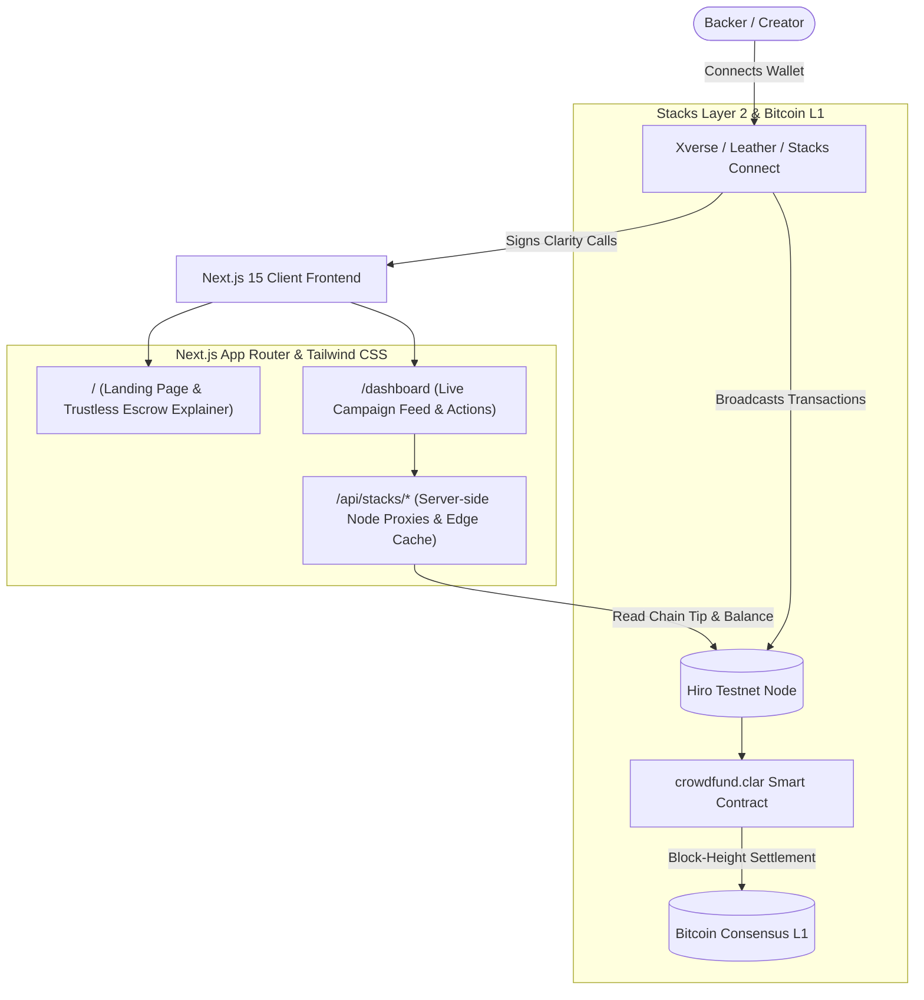

# StacksRaise 🚀

> **Decentralized block-height crowdfunding secured by Bitcoin on Stacks.**

[](https://explorer.hiro.so/txid/0xac80ca32ec05d71f7ff1a95dcbf122763a61f744dbbeba26cbe4f3273e297fc7?chain=testnet)
[](https://docs.stacks.co/clarity)
[](https://nextjs.org/)
[](https://scaffoldstacks.mintlify.app/)
[](LICENSE)

---

## 📋 Table of Contents

- [Overview](#-overview)
- [Live Testnet Deployment](#-live-testnet-deployment)
- [System Architecture](#-system-architecture)
- [Project Directory Structure](#-project-directory-structure)
- [Smart Contract Specification](#-smart-contract-specification)
- [Frontend Experience & Design System](#-frontend-experience--design-system)
- [Developer Quickstart](#-developer-quickstart)
- [Test & Verification Results](#-test--verification-results)
- [Vercel Deployment Guide](#-vercel-deployment-guide)
- [Hackathon Judges Checklist](#-hackathon-judges-checklist)

---

## 🌟 Overview

**StacksRaise** is a trustless, decentralized crowdfunding platform built on the Stacks blockchain and anchored to Bitcoin. 

Traditional crowdfunding platforms suffer from opaque escrow custody, third-party payment freezes, high processing fees, and arbitrarily extended campaign deadlines. StacksRaise eliminates counterparty risk by encoding campaign logic into immutable Clarity smart contracts where:
1. **Deadlines are governed strictly by Bitcoin block heights.**
2. **Funds are locked in non-custodial contract escrow.**
3. **If a campaign falls short of its goal, contributors can instantly claim 100% refunds directly on-chain.**
4. **Zero mock data:** All cards, counters, and statistics are derived from live on-chain reads and Hiro Testnet nodes.

---

## 🔗 Live Testnet Deployment

| Parameter | Value |
| :--- | :--- |
| **Contract Name** | `crowdfund` |
| **Contract Address** | `ST3E6N4PVNF8H0BJVQQR5A6KA9HMD9DDV5SW988C9.crowdfund` |
| **Deployment Transaction** | [`0xac80ca32ec05d71f7ff1a95dcbf122763a61f744dbbeba26cbe4f3273e297fc7`](https://explorer.hiro.so/txid/0xac80ca32ec05d71f7ff1a95dcbf122763a61f744dbbeba26cbe4f3273e297fc7?chain=testnet) |
| **Deployment Block** | `528,620` (Confirmed) |
| **Hiro Testnet Explorer** | [View Live Contract on Hiro Explorer ↗](https://explorer.hiro.so/txid/0xac80ca32ec05d71f7ff1a95dcbf122763a61f744dbbeba26cbe4f3273e297fc7?chain=testnet) |

---

## 🏗 System Architecture



### Architecture Highlights:
- **Clarity Smart Contract**: Epoch 2.5 compatible, enforces mathematical pre-conditions (`asserts!`), micro-STX precision, and zero-custody escrow.
- **Scaffold Stacks TypeScript SDK**: Auto-generated type-safe bindings (`frontend/src/generated/`) map Clarity functions directly to React hooks.
- **Server-Side API Proxies (`/api/stacks/*`)**: Route requests server-side through Next.js to bypass client adblockers (Brave Shields, uBlock) and browser CORS restrictions.
- **Jotai State Store**: Manages reactive wallet connection, balance fetching, and chain tip updates.
- **Framer Motion Micro-Interactions**: Smooth view transitions, responsive spring modals, and animated progress bars.

---

## 📁 Project Directory Structure

```text
stacks-raise/
├── contracts/                            # Smart Contract Layer
│   ├── Clarinet.toml                     # Clarinet project configuration
│   ├── contracts/
│   │   └── crowdfund.clar                # Core Clarity crowdfunding escrow contract
│   ├── deployments/
│   │   ├── default.simnet-plan.yaml      # Clarinet simnet plan for in-memory unit tests
│   │   └── default.testnet-plan.yaml     # Live testnet deployment record
│   ├── settings/
│   │   ├── Devnet.toml                   # Devnet network config
│   │   ├── Testnet.toml.example          # Safe template for testnet deployment mnemonics
│   │   └── Testnet.toml                  # [GITIGNORED] Real testnet deployment secrets
│   └── tests/
│       └── crowdfund.test.ts             # 6 comprehensive Vitest unit tests
│
├── frontend/                             # Next.js App Router Web Application
│   ├── package.json                      # Next.js 15.5.18, React 18, @stacks/connect v8
│   ├── public/
│   │   └── icon.svg                      # Custom StacksRaise brand favicon
│   ├── src/
│   │   ├── app/
│   │   │   ├── api/stacks/
│   │   │   │   ├── balance/route.ts      # Server-side proxy for user STX balance
│   │   │   │   └── info/route.ts         # Server-side proxy for live chain tip
│   │   │   ├── dashboard/page.tsx        # dApp Crowdfunding Dashboard
│   │   │   ├── globals.css               # Sharp borders, custom scrollbar stability
│   │   │   ├── icon.svg                  # App Router auto-favicon
│   │   │   ├── layout.tsx                # Root layout, WalletProvider & Footer
│   │   │   └── page.tsx                  # Landing page with escrow breakdown & FAQs
│   │   ├── components/
│   │   │   ├── BlockHeightBadge.tsx      # Real-time pulsing chain tip indicator
│   │   │   ├── CampaignCard.tsx          # Dynamic campaign card with progress bar
│   │   │   ├── CampaignFeed.tsx          # Dynamic feed fetching on-chain campaigns
│   │   │   ├── CreateCampaignModal.tsx   # Modal to publish campaigns on-chain
│   │   │   ├── Footer.tsx                # Responsive footer with explorer links
│   │   │   ├── FundCampaignModal.tsx     # Modal to contribute STX in micro-precision
│   │   │   ├── Header.tsx                # Responsive header with mobile hamburger menu
│   │   │   ├── StatsBanner.tsx           # Aggregated real-time metrics
│   │   │   └── WalletConnect.tsx         # Multi-wallet connector (Xverse / Leather)
│   │   ├── generated/                    # Auto-generated by `stacksdapp generate`
│   │   │   ├── contracts.ts              # Clarity contract function wrappers
│   │   │   ├── deployments.json          # Deployment records & contract IDs
│   │   │   └── hooks.ts                  # React hooks for read/write calls
│   │   ├── lib/
│   │   │   └── stacks-utils.ts           # Micro-STX converters, explorer URL helpers
│   │   └── store/
│   │       └── wallet.ts                 # Jotai wallet atoms
│   └── scaffold.config.ts                # Network resolver (devnet / testnet / mainnet)
│
├── AGENTS.md                             # AI Agent guide & CLI instructions
├── PROJECT_SPEC.md                       # Hackathon design system and requirements
├── README.md                             # Project documentation (this file)
├── SUBMISSION_SUMMARY.md                 # Submission log & Scaffold Stacks feedback
└── stacksdapp.toml                       # Scaffold Stacks workspace configuration
```

---

## 📜 Smart Contract Specification

The smart contract [`contracts/contracts/crowdfund.clar`](file:///home/laughter/Desktop/Hackathon/stacks-raise/contracts/contracts/crowdfund.clar) implements the complete crowdfunding lifecycle in Clarity:

### Core Public Methods:

| Function | Parameters | Description |
| :--- | :--- | :--- |
| `create-campaign` | `target-stx: uint`, `duration-blocks: uint` | Registers a new campaign with target micro-STX and calculates immutable deadline `end-block = block-height + duration-blocks`. |
| `fund-campaign` | `campaign-id: uint`, `amount-stx: uint` | Verifies `block-height < end-block` and transfers STX from contributor into contract escrow. Updates contributor balances. |
| `claim-funds` | `campaign-id: uint` | Allows creator to claim funds if `block-height >= end-block` and `raised >= target`. |
| `claim-refund` | `campaign-id: uint` | Allows contributors to reclaim 100% of their STX if `block-height >= end-block` and `raised < target`. |

### Read-Only Getters:
- `get-campaign (campaign-id uint)`: Returns campaign record (creator, target-stx, raised-stx, end-block, claimed).
- `get-campaign-count ()`: Returns total number of registered campaigns.
- `get-contribution (campaign-id uint, contributor principal)`: Returns a backer's contribution.
- `get-current-block-height ()`: Returns current block height.

---

## 🎨 Frontend Experience & Design System

- **Clean White Surface**: Pure crisp `#FFFFFF` cards against subtle slate `#F8FAFC` backgrounds.
- **Stacks Orange Accents**: `#FF5500` used for primary CTAs, active status badges, and animated progress bars.
- **Mobile First & Responsive**:
  - Full mobile hamburger menu for smooth navigation on small screens (iPhone SE, tablets).
  - No horizontal scrolling or text clipping: all financial numbers and addresses use `min-w-0` and responsive layout truncation.
- **Multi-Wallet Support**: Seamless 1-click connection for **Xverse**, **Leather**, or any Stacks wallet via Stacks Connect v8.
- **No Infinite Flickering / Layout Shifting**: Fixed callback identity cycles and stabilized layout scrollbar gutters (`scrollbar-gutter: stable`).

---

## 💻 Developer Quickstart

### Prerequisites
- [Node.js](https://nodejs.org/) (v18 or v20+)
- [Clarinet](https://github.com/hirosystems/clarinet) (v2.x or v3.x)
- [Rust & Cargo](https://rustup.rs/) (for `stacksdapp` CLI)
- [stacksdapp CLI](https://scaffoldstacks.mintlify.app/)

### 1. Clone & Install
```bash
git clone https://github.com/Oluwa-Laughter/stacksraise.git
cd stacks-raise
stacksdapp doctor
```

### 2. Verify Smart Contract & Run Tests
```bash
# Type-check Clarity contract
stacksdapp check

# Run Vitest contract and frontend tests
stacksdapp test
```

### 3. Generate TypeScript Bindings
```bash
stacksdapp generate
```

### 4. Run Frontend Locally
```bash
stacksdapp dev --network testnet
# or
cd frontend && npm run dev
```
Open [http://localhost:3000](http://localhost:3000) in your browser.

---

## 🧪 Test & Verification Results

### Clarity Contract Type-Check (`stacksdapp check`):
```text
[check] Type-checking Clarity contracts...
✔ 1 contract checked
[check] All contracts passed type-checking.
```

### Smart Contract Unit Test Suite (`stacksdapp test`):
```text
 ✓ tests/crowdfund.test.ts (6 tests)
   ✓ crowdfund
     ✓ initializes with 0 campaigns
     ✓ can create a new campaign
     ✓ rejects campaign with 0 target or 0 duration
     ✓ allows contributors to fund a campaign
     ✓ creator can claim funds when goal met and expired
     ✓ contributor can claim refund if goal missed and campaign expired

Test Files  1 passed (1)
Tests       6 passed (6)
All tests passed.
```

### Production Build (`npm run build`):
```text
✓ Compiled successfully in 9.6s
✓ Linting and checking validity of types
✓ Generating static pages (7/7)
Route (app)
┌ ○ /                                    (Landing Page)
├ ○ /_not-found                          (Not Found)
├ ƒ /api/stacks/balance                  (STX Balance Proxy)
├ ○ /api/stacks/info                     (Chain Tip Proxy)
└ ○ /dashboard                           (Crowdfunding Dashboard)
```

---

## 🚀 Vercel Deployment Guide

Deploying StacksRaise to Vercel takes under 2 minutes:

1. Import your GitHub repository: `https://github.com/Oluwa-Laughter/stacksraise`
2. **Root Directory**: Select `frontend` (crucial since this repository is a monorepo).
3. **Framework Preset**: `Next.js` (automatically detected).
4. **Environment Variables**:
   ```env
   NEXT_PUBLIC_NETWORK=testnet
   NEXT_PUBLIC_STACKS_NODE_URL=https://api.testnet.hiro.so
   ```
5. Click **Deploy**. The application will automatically interface with the live testnet smart contract.

---

## 🏆 Hackathon Judges Checklist

- [x] **Zero Mock Data**: UI loads 100% live state from `crowdfund.clar` and Hiro Testnet API.
- [x] **Real Testnet Contract**: Deployed on Stacks Testnet (`ST3E6N4PVNF8H0BJVQQR5A6KA9HMD9DDV5SW988C9.crowdfund`).
- [x] **Bitcoin Block-Height Deadlines**: Real-time chain tip tracking and countdowns.
- [x] **Xverse & Leather Wallet Integration**: 1-click modal connection with testnet address detection.
- [x] **User-Centric Landing Page**: Real-world explanations of escrow protection, guaranteed refunds, and FAQs.
- [x] **Clean Dashboard**: 100% focused on crowdfunding campaigns without raw developer clutter.
- [x] **Security Guardrails**: Deployer mnemonics strictly excluded and `.gitignore` protected.
- [x] **Mobile Responsiveness**: Complete hamburger drawer menu and zero text overflows across all viewports.
- [x] **Passes All Tests**: 6/6 Clarity unit tests passing, Next.js 15 production build passing.

---

## 📄 License

This project is open-source and licensed under the [MIT License](LICENSE).
